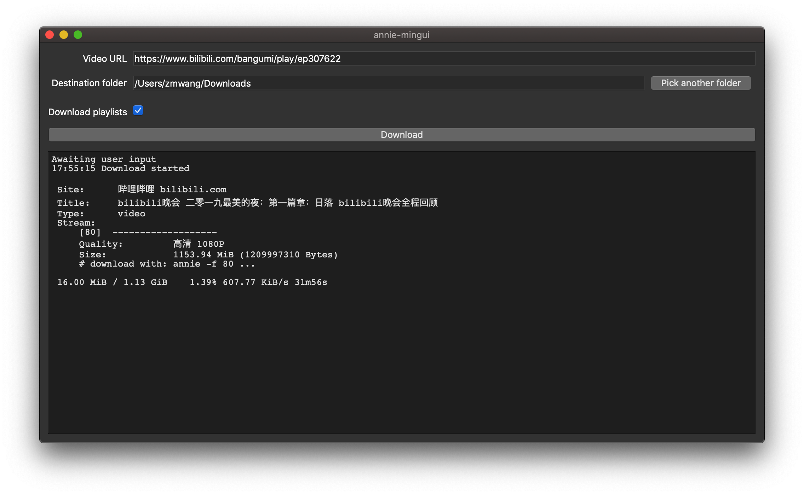

# annie-mingui

annie-mingui is a minimal GUI for [iawia002/annie](https://github.com/iawia002/annie), the video downloader.

It is in part an experiment to build a GUI application in Go, coming from someone who's written a grand total of <1k lines of Go. It's not a roaring success. Other GUI toolkits are incomplete and terrible all around, the Qt binding is at least usable (I wasn't able to install it in go modules mode though, and related bug reports haven't seen any activity since they've been posted a while ago) but compilation is very slow especially on Windows (I also had to jump through undocumented hoops on Windows to sidestep build errors). Documentation besides some examples is basically nonexistent.

As for the result itself, one extremely annoying bug is random crashing every few minutes. Downloads are resumable but apparently no one wants to monitor and relaunch every few minutes. I spent a bit of time debugging but wasn't able to track it down. I'm not fluent in Qt to begin with and the binding seems to differ fundamentally on the signal/slot side; compounded by the fact that I'm new to Go too, I think it must come down to defective understanding of the concurrency model somewhere along the line.
